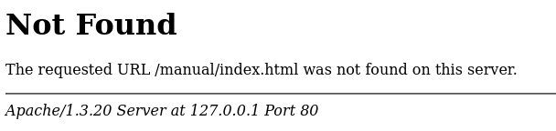

# Scanning & Enumeration

## Installing Kioptrix

2021 update

- https://www.vulnhub.com/entry/kioptrix-level-1-1,22/
- we'll actually use https://tcm-sec.com/kioptrix, download the kioptrix ova file
- import the ova file as a new virtual machine in vmware, allocate 256 Mo of memory, check that NAT is enabled.

## Scanning with Nmap

- play, kioptrix login is `john`, password is `TwoCows2`
- `ping 8.8.8.8` to know your target ip address
- `ifconfig` on your kali linux machine to get your ip address
- `arp-scan -l` to identify IPs of vmware machines
- `netdiscover -r 192.168.92.0/24` to explore the subnet and find the target ip address, `ctrl C` to quit.

Nmap stands for network mapper, scans for open ports (stealth scanning, but nowadays is very detectable). The port says it's opened, that's just what we want to know.

- `nmap -T4 -p- -A 192.168.92.129`, speed T from 1 to 5, 4 is a personal preference, `-p-` to scan all ports (top 1000 ports if not provided, 65535 with `-p-`), `-A` to get all the information it can get. `-A` takes longer, so it's better to first know the open ports, and run a second command specific to these ports with `-p 22,80 -A`
- `nmap --help` to see all the available options.

```
PORT      STATE SERVICE     VERSION
22/tcp    open  ssh         OpenSSH 2.9p2 (protocol 1.99)
| ssh-hostkey:
|   1024 b8:74:6c:db:fd:8b:e6:66:e9:2a:2b:df:5e:6f:64:86 (RSA1)
|   1024 8f:8e:5b:81:ed:21:ab:c1:80:e1:57:a3:3c:85:c4:71 (DSA)
|_  1024 ed:4e:a9:4a:06:14:ff:15:14:ce:da:3a:80:db:e2:81 (RSA)
|_sshv1: Server supports SSHv1
80/tcp    open  http        Apache httpd 1.3.20 ((Unix)  (Red-Hat/Linux) mod_ssl/2.8.4 OpenSSL/0.9.6b)
|_http-server-header: Apache/1.3.20 (Unix)  (Red-Hat/Linux) mod_ssl/2.8.4 OpenSSL/0.9.6b
|_http-title: Test Page for the Apache Web Server on Red Hat Linux
| http-methods:
|_  Potentially risky methods: TRACE
111/tcp   open  rpcbind     2 (RPC #100000)
| rpcinfo:
|   program version    port/proto  service
|   100000  2            111/tcp   rpcbind
|   100000  2            111/udp   rpcbind
|   100024  1          32768/tcp   status
|_  100024  1          32768/udp   status
139/tcp   open  netbios-ssn Samba smbd (workgroup: MYGROUP)
443/tcp   open  ssl/https   Apache/1.3.20 (Unix)  (Red-Hat/Linux) mod_ssl/2.8.4 OpenSSL/0.9.6b
|_ssl-date: 2024-07-11T14:28:00+00:00; +6h00m09s from scanner time.
|_http-title: 400 Bad Request
| ssl-cert: Subject: commonName=localhost.localdomain/organizationName=SomeOrganization/stateOrProvinceName=SomeState/countryName=--
| Not valid before: 2009-09-26T09:32:06
|_Not valid after:  2010-09-26T09:32:06
| sslv2:
|   SSLv2 supported
|   ciphers:
|     SSL2_RC4_128_EXPORT40_WITH_MD5
|     SSL2_DES_64_CBC_WITH_MD5
|     SSL2_RC4_128_WITH_MD5
|     SSL2_RC2_128_CBC_WITH_MD5
|     SSL2_DES_192_EDE3_CBC_WITH_MD5
|     SSL2_RC4_64_WITH_MD5
|_    SSL2_RC2_128_CBC_EXPORT40_WITH_MD5
|_http-server-header: Apache/1.3.20 (Unix)  (Red-Hat/Linux) mod_ssl/2.8.4 OpenSSL/0.9.6b
32768/tcp open  status      1 (RPC #100024)
MAC Address: 00:0C:29:8E:87:5B (VMware)
Device type: general purpose
Running: Linux 2.4.X
OS CPE: cpe:/o:linux:linux_kernel:2.4
OS details: Linux 2.4.9 - 2.4.18 (likely embedded)
Network Distance: 1 hop

Host script results:
|_nbstat: NetBIOS name: KIOPTRIX, NetBIOS user: <unknown>, NetBIOS MAC: <unknown> (unknown)
|_smb2-time: Protocol negotiation failed (SMB2)
|_clock-skew: 6h00m08s

TRACEROUTE
HOP RTT     ADDRESS
1   0.88 ms 192.168.92.129

```

Now, we need to find exploits on these info.

## Enumerating HTTP and HTTPS Part 1

- wannacry was using a flaw in smb.
- we're looking for low hanging fruit, ssh is difficult.
- let's start with ports 80 and 443.
- go back to use system proxy settings in firefox settings.
- let's open `http://192.168.92.129` and `https://192.168.92.129` in firefox
- we now know it's using apache on red hat linux. Maybe other directories available, or they just forgot about it (poor hygiene).
- the 404 gives us the apache version and the internal host name `kioptrix.level1`.

Notes

```
80/443 - 192.168.92.129 - 11:19
default webpage - apache - php
Information disclosure - 404 page
```



### Nikto

vulnerability scanner, good for beginning, might be blocked by security tools.

`nikto -h http://192.168.92.129`

```
- Nikto v2.5.0
---------------------------------------------------------------------------
+ Target IP:          192.168.92.129
+ Target Hostname:    192.168.92.129
+ Target Port:        80
+ Start Time:         2024-07-11 05:29:38 (GMT-4)
---------------------------------------------------------------------------
+ Server: Apache/1.3.20 (Unix)  (Red-Hat/Linux) mod_ssl/2.8.4 OpenSSL/0.9.6b
+ /: Server may leak inodes via ETags, header found with file /, inode: 34821, size: 2890, mtime: Wed Sep  5 23:12:46 2001. See: http://cve.mitre.org/cgi-bin/cvename.cgi?name=CVE-2003-1418
+ /: The anti-clickjacking X-Frame-Options header is not present. See: https://developer.mozilla.org/en-US/docs/Web/HTTP/Headers/X-Frame-Options
+ /: The X-Content-Type-Options header is not set. This could allow the user agent to render the content of the site in a different fashion to the MIME type. See: https://www.netsparker.com/web-vulnerability-scanner/vulnerabilities/missing-content-type-header/
+ Apache/1.3.20 appears to be outdated (current is at least Apache/2.4.54). Apache 2.2.34 is the EOL for the 2.x branch.
+ mod_ssl/2.8.4 appears to be outdated (current is at least 2.9.6) (may depend on server version).
+ OpenSSL/0.9.6b appears to be outdated (current is at least 3.0.7). OpenSSL 1.1.1s is current for the 1.x branch and will be supported until Nov 11 2023.
+ /: Apache is vulnerable to XSS via the Expect header. See: http://cve.mitre.org/cgi-bin/cvename.cgi?name=CVE-2006-3918
+ OPTIONS: Allowed HTTP Methods: GET, HEAD, OPTIONS, TRACE .
+ /: HTTP TRACE method is active which suggests the host is vulnerable to XST. See: https://owasp.org/www-community/attacks/Cross_Site_Tracing
+ Apache/1.3.20 - Apache 1.x up 1.2.34 are vulnerable to a remote DoS and possible code execution.
+ Apache/1.3.20 - Apache 1.3 below 1.3.27 are vulnerable to a local buffer overflow which allows attackers to kill any process on the system.
+ Apache/1.3.20 - Apache 1.3 below 1.3.29 are vulnerable to overflows in mod_rewrite and mod_cgi.
+ mod_ssl/2.8.4 - mod_ssl 2.8.7 and lower are vulnerable to a remote buffer overflow which may allow a remote shell.
+ ///etc/hosts: The server install allows reading of any system file by adding an extra '/' to the URL.
+ /usage/: Webalizer may be installed. Versions lower than 2.01-09 vulnerable to Cross Site Scripting (XSS). See: http://cve.mitre.org/cgi-bin/cvename.cgi?name=CVE-2001-0835
+ /manual/: Directory indexing found.
+ /manual/: Web server manual found.
+ /icons/: Directory indexing found.
+ /icons/README: Apache default file found. See: https://www.vntweb.co.uk/apache-restricting-access-to-iconsreadme/
+ /test.php: This might be interesting.
+ /wp-content/themes/twentyeleven/images/headers/server.php?filesrc=/etc/hosts: A PHP backdoor file manager was found.
+ /wordpress/wp-content/themes/twentyeleven/images/headers/server.php?filesrc=/etc/hosts: A PHP backdoor file manager was found.
+ /wp-includes/Requests/Utility/content-post.php?filesrc=/etc/hosts: A PHP backdoor file manager was found.
+ /wordpress/wp-includes/Requests/Utility/content-post.php?filesrc=/etc/hosts: A PHP backdoor file manager was found.
+ /wp-includes/js/tinymce/themes/modern/Meuhy.php?filesrc=/etc/hosts: A PHP backdoor file manager was found.
+ /wordpress/wp-includes/js/tinymce/themes/modern/Meuhy.php?filesrc=/etc/hosts: A PHP backdoor file manager was found.
+ /assets/mobirise/css/meta.php?filesrc=: A PHP backdoor file manager was found.
+ /login.cgi?cli=aa%20aa%27cat%20/etc/hosts: Some D-Link router remote command execution.
+ /shell?cat+/etc/hosts: A backdoor was identified.
+ /#wp-config.php#: #wp-config.php# file found. This file contains the credentials.
+ 8908 requests: 0 error(s) and 30 item(s) reported on remote host
+ End Time:           2024-07-11 05:30:05 (GMT-4) (27 seconds)
---------------------------------------------------------------------------
+ 1 host(s) tested
```

Notes

```
Outdated versions - Apache, mod_ssl, openSSL
Possible exploit - mod_ssl 2.8.7 and lower are vulnerable to a remote buffer overflow which may allow a remote shell.
```

To save the report

```
mkdir kioptrix
cd kioptrix
gedit nikto.txt
```

Paste & save the report

## Enumerating HTTP and HTTPS Part 2

dirbuster, dirb, gobuster to do directory

- run `dirbuster&`
- `http://192.168.92.129:80` as target, activate go faster
- browse to add this list: `/usr/share/wordlists/dirbuster/directory-list-2.3-small.txt`
- `php` for file extensions (zip, txt, adapt to the stack, asp or aspx for microsoft)
- start the scan, use tree and results views to check the findings (right click to open in browser php files).
- inspect source code, look for info disclosure in comments, keys, passwords.
- usage.html: `Webalizer Version 2.01`

While we're waiting:

- reactivate your firefox proxy, open burp suite, intercept on in proxy, right click & send to repeater.
- new repeater tab should show. We can now edit the request and send it.
- in the target tab, we can edit the scope. Add `http://192.168.92.129/` and say yes.

```
Starting OWASP DirBuster 1.0-RC1
Starting dir/file list based brute forcing
Dir found: / - 200
Dir found: /cgi-bin/ - 403
Dir found: /icons/ - 200
Dir found: /doc/ - 403
File found: /test.php - 200
Dir found: /manual/ - 200
Dir found: /manual/mod/ - 200
Dir found: /icons/small/ - 200
Dir found: /usage/ - 200
File found: /usage/usage_202407.html - 200
File found: /usage/usage_200909.html - 200
Dir found: /mrtg/ - 200
File found: /mrtg/mrtg.html - 200
File found: /mrtg/unix-guide.html - 200
File found: /mrtg/cfgmaker.html - 200
File found: /mrtg/indexmaker.html - 200
File found: /mrtg/reference.html - 200
File found: /mrtg/faq.html - 200
File found: /mrtg/forum.html - 200
File found: /mrtg/contrib.html - 200
File found: /mrtg/mrtg-rrd.html - 200
File found: /mrtg/logfile.html - 200
File found: /mrtg/squid.html - 200
File found: /mrtg/mibhelp.html - 200
File found: /mrtg/webserver.html - 200
File found: /mrtg/nt-guide.html - 200
Dir found: /manual/mod/mod_perl/ - 200
Dir found: /manual/mod/mod_ssl/ - 200
File found: /manual/mod/mod_ssl/ssl_overview.html - 200
File found: /manual/mod/mod_ssl/index.html - 200
File found: /manual/mod/mod_ssl/ssl_intro.html - 200
File found: /manual/mod/mod_ssl/ssl_reference.html - 200
File found: /manual/mod/mod_ssl/ssl_compat.html - 200
File found: /manual/mod/mod_ssl/ssl_howto.html - 200
File found: /manual/mod/mod_ssl/ssl_glossary.html - 200
File found: /manual/mod/mod_ssl/ssl_faq.html - 200
```

Notes

```
Information Disclosure - server headers disclose version information - Apache 1.3.20, mod_ssl 2.8.4, openSSL 0.9.6b
Webalizer Version 2.01 (http://192.168.92.129/usage/)
```

Have a methodology, whatever the port is:

- look for service version info
- look for back-end directories
- look for potential vulnerabilities with nikto
- look for the stack with wappalyzer

## Enumerating SMB

smb file share

### Metasploit

- run `msfconsole` in the terminal. Metasploit is for exploitation, port scanning, post exploitation.
- type `search smb`. In results, type is the first element (exploit, auxiliary), then we have the type of action.
- `use auxiliary/scanner/smb/smb_version`, then type `info` to know the module behavior or `options` to get directly the options. `RHOSTS` is the remote host (the target).
- `set RHOSTS 192.168.92.129` and `run`

Notes

```
SMB - Unix (Samba 2.2.1a)
```

you'll be successful if you have the ability to gather info and enumerate properly.

### smbclient

to connect & see potential shared files.

- open a new terminal tab, enter `smbclient -L \\\\192.168.92.129\\`, type enter when asked for a password.
- two folders, we try `smbclient -L \\\\192.168.92.129\\ADMIN$` and `\\\\192.168.92.129\\IPC$`, anonymous login successful, but access to the files is denied (when doing `ls`)

## Enumerating SSH

Notes

```
OpenSSH 2.9p2 (protocol 1.99)
```

- run `ssh 192.168.92.129` or `ssh 192.168.92.129 -oKexAlgorithms=+diffie-hellman-group1-sha1 -c aes128-cbc` because the target is old. Type `yes` to confirm you want to connect. Password asked, so it's over for the info gathering part (sometimes we get info disclosure about the SSH version in a banner). Spray and pray (brute force).

## Researching Potential Vulnerabilities

Notes

```
80/443 - 192.168.92.129 - 11:19
default webpage - apache - php
Information disclosure - 404 page

Outdated versions - Apache, mod_ssl, openSSL
Possible exploit - mod_ssl 2.8.7 and lower are vulnerable to a remote buffer overflow which may allow a remote shell.

Information Disclosure - server headers disclose version information - Apache 1.3.20, mod_ssl 2.8.4, openSSL 0.9.6b
Webalizer Version 2.01 (http://192.168.92.129/usage/)

SMB
Unix (Samba 2.2.1a)

SSH
OpenSSH 2.9p2 (protocol 1.99)
```

80, then 433, then 139/445

We look for `mod_ssl 2.8.7 exploit` on Google. Read the code, make sure it can't do harm to your own machine.

```
80/443 - Potentially vulnerable to OpenLuck (https://www.exploit-db.com/exploits/764), https://github.com/heltonWernik/OpenLuck
```

We also check `Apache 1.3.20 exploit`. On cvedetails, red flags are interesting (https://www.cvedetails.com/vulnerability-list/vendor_id-45/product_id-66/version_id-371592/Apache-Http-Server-1.3.20.html?page=1&cvssscoremin=8&order=1&trc=8&sha=6d26d89b3754eda3acf4098d3cc8bf718f8405f6).

We then proceed with `Samba 2.2.1a exploit`. Rapid7 makes metasploit (https://www.rapid7.com/db/modules/exploit/linux/samba/trans2open/). We do have anonymous access to IPC.

```
139 - Potentially vulnerable to trans2open (https://www.rapid7.com/db/modules/exploit/linux/samba/trans2open/), https://www.exploit-db.com/exploits/7, https://www.exploit-db.com/exploits/10
```

If you have no remote access, you can use `searchsploit`. For example, `searchsploit Samba 2.2.1a`:

```
------------------------------------------- ---------------------------------
 Exploit Title                             |  Path
------------------------------------------- ---------------------------------
Samba 2.2.0 < 2.2.8 (OSX) - trans2open Ove | osx/remote/9924.rb
Samba < 2.2.8 (Linux/BSD) - Remote Code Ex | multiple/remote/10.c
Samba < 3.0.20 - Remote Heap Overflow      | linux/remote/7701.txt
Samba < 3.6.2 (x86) - Denial of Service (P | linux_x86/dos/36741.py
------------------------------------------- ---------------------------------
Shellcodes: No Results

```

exploits, unix or linux, remote are what we're looking for.

```
webalizer, script injection https://www.exploit-db.com/papers/13017
```

```
searchsploit OpenSSH 2.9p2
------------------------------------------- ---------------------------------
 Exploit Title                             |  Path
------------------------------------------- ---------------------------------
OpenSSH 2.3 < 7.7 - Username Enumeration   | linux/remote/45233.py
OpenSSH 2.3 < 7.7 - Username Enumeration ( | linux/remote/45210.py
OpenSSH < 6.6 SFTP (x64) - Command Executi | linux_x86-64/remote/45000.c
OpenSSH < 6.6 SFTP - Command Execution     | linux/remote/45001.py
OpenSSH < 7.4 - 'UsePrivilegeSeparation Di | linux/local/40962.txt
OpenSSH < 7.4 - agent Protocol Arbitrary L | linux/remote/40963.txt
OpenSSH < 7.7 - User Enumeration (2)       | linux/remote/45939.py
------------------------------------------- ---------------------------------
Shellcodes: No Results
```

## Our Notes So Far

Notes are to be understandable, and with a good hierarchy.
